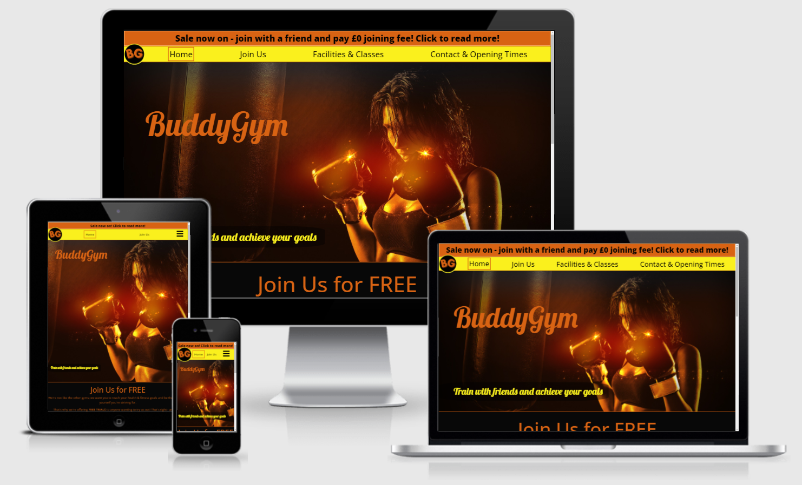

<h1 align="center">"BuddyGym" Website</h1>
<a href="https://danwilliams91.github.io/BuddyGym/">Link to the deployed website.</a>

 

The BuddyGym website represents a website of a fictional organisation named BuddyGym.

BuddyGym is a gym which offers incentives for potential members to sign up with a friend or family member. In doing so, members will enjoy a waived joining fee whilst BuddyGym gains an additional membership signup.

The BuddyGym website is designed to be responsive and accessible on a range of device sizes. The design approach was to begin the development of the webpage for smaller screen sizes, such as mobile phones, with responsivity then being incrementally added for display on medium-and-larger-sized screens.

The purpose of the website, in terms of the organisation’s objectives, is to generate membership sales and to provide its members with a variety of contact options, thus improving the satisfaction of its existing members. The website also allows new visitors to learn about the organisation and what it has to offer, as well as providing them with a good first impression of the organisation based on its clear website content with minimal—if any—grammatical errors. Returning visitors who want to learn more about the organisation are easily able to contact the organisation, either within the website itself or via the links to the organisation’s social media pages, located throughout the site. Frequent users’ needs are also addressed, with links to class timetables—updated on a weekly basis—and a facility to book a class or contact the organisation for any other reason.

The website is designed to include information relevant to all user categories, including membership prices, information on available facilities, sale information, contact information and the ability for users to directly contact the organisation using forms within the website.

<!--Below image sourced from sourced from http://ami.responsivedesign.is/-->

## User Experience (UX)
* ### User Stories
    * #### First Time Visitor Goals
        a)	As a First Time Visitor, I want to easily and quickly understand the main purpose of the site and learn what the organisation has to offer.

        b)	As a First Time Visitor, I want to be able to easily navigate throughout the site to find the content I’m looking for.

        c)	As a First Time Visitor, I want to know where the organisation is based.

    * #### Returning Visitor Goals
        a)	As a Returning Visitor, I want to be able to easily and quickly find out how to contact the organisation.

        b)	As a Returning Visitor, I want to understand the various options on offer in relation to membership costs.

        c)	As a Returning Visitor, I want to know why this organisation differs from others in relation to their facilities.

    * #### Frequent User Goals
        a)	As a Frequent User, I want to view the organisation’s opening times.

        b)	As a Frequent User, I want to view the class timetables and know how to attend classes.

        c)	As a Frequent User, I want to know if the organisation has any social media pages so that I can keep updated with any announcements.

* ### Design
    * #### Colour Scheme
        * The main colours used throughout the site are orange and yellow, based on information obtained from a blog posted on the <a href="https://coschedule.com/blog/color-psychology-marketing" target="_blank">CoSchedule website.</a> The blog states that orange and yellow are colours which can inspire motivation, which was the main reason behind the decision to use the colours as a main theme for the website.

    * #### Typography
        * The Open Sans font is the main font used throughout the site, with a secondary font of Lobster used for the hero image overlay. In case the chosen fonts are not imported into the site correctly, a fallback font of sans-serif has been used. Open Sans was used as it is a popular font with widespread compatibility, as well as being easy to read. Lobster was used for the font overlaying the hero image as this font is more eye-catching, which was more appropriate for the hero image – the first thing the user sees upon visiting the site.

    * #### Imagery
        * To capture the user’s attention when first visiting the website, a hero image has been used to convey interest and to assist the user in determining the nature of the website. The colours of this hero image are consistent with the rest of the site and the image used is of an inspiring nature.

* ### Wireframes
    * Home Page
        * <a href="assets/docs/wireframes/home-page-mobile.png" target="_blank">Mobile version.</a>
        * <a href="assets/docs/wireframes/home-page-tablet.png" target="_blank">Tablet version.</a>
        * <a href="assets/docs/wireframes/home-page-desktop.png" target="_blank">Desktop version.</a>
    * Join Us Page
        * <a href="assets/docs/wireframes/join-page-mobile.png" target="_blank">Mobile version.</a>
        * <a href="assets/docs/wireframes/join-page-tablet.png" target="_blank">Tablet version.</a>
        * <a href="assets/docs/wireframes/join-page-desktop.png" target="_blank">Desktop version.</a>
    * Facilities & Classes Page
        * <a href="assets/docs/wireframes/facilities-page-mobile.png" target="_blank">Mobile version.</a>
        * <a href="assets/docs/wireframes/facilities-page-tablet.png" target="_blank">Tablet version.</a>
        * <a href="assets/docs/wireframes/facilities-page-desktop.png" target="_blank">Desktop version.</a>
    * Contact Us Page
        * <a href="assets/docs/wireframes/contact-page-mobile.png" target="_blank">Mobile version.</a>
        * <a href="assets/docs/wireframes/contact-page-tablet.png" target="_blank">Tablet version.</a>
        * <a href="assets/docs/wireframes/contact-page-desktop.png" target="_blank">Desktop version.</a>
## Features

* Responsive on all device sizes.

## Technologies Used

### Languages Used

* <a href="https://en.wikipedia.org/wiki/HTML5" target="_blank">HTML5.</a>
* <a href="https://en.wikipedia.org/wiki/CSS" target="_blank">CSS3.</a>

### Frameworks, Libraries & Programs Used

1. <a href="https://getbootstrap.com/" target="_blank">Bootstrap 4.5.3:</a>
    * Bootstrap was used to assist with the responsiveness and styling of the website.
2. <a href="https://fonts.google.com/" target="_blank">Google Fonts:</a>
    * Google fonts was used to import the ‘Open Sans’ and ‘Lobster’ fonts into the style.css file which is used on all pages throughout the website.
3. <a href="https://fontawesome.com/" target="_blank">Font Awesome:</a>
    * Font Awesome was used on all pages throughout the website to add icons for aesthetic and user experience purposes.
4. <a href="https://git-scm.com/" target="_blank">Git:</a>
    * Git was used for version control by utilizing the Gitpod terminal to commit to Git and Push to GitHub.
5. <a href="https://github.com/" target="_blank">GitHub:</a>
    * GitHub is used to store the projects’ code after being pushed from Git.
6. <a href="https://en.wikipedia.org/wiki/Microsoft_Paint" target="_blank">Microsoft Paint:</a>
    * Microsoft Paint was used to create the logo, resizing images and editing photos for the website.
7. <a href="https://www.microsoft.com/en-us/microsoft-365/word" target="_blank">Microsoft Word:</a>
    * Microsoft Word was used to crop the logo into a circular image.
8. <a href="https://balsamiq.com/wireframes/" target="_blank">Balsamiq:</a>
    * Balsamiq was used to create the wireframes during the design process.

## Testing

The W3C Markup Validator and W3C CSS Validator Services were used to validate every page of the project to ensure there were no syntax errors in the project.

* <a href="https://validator.w3.org/" target="_blank">W3C Markup Validator</a>
    * <a href="https://validator.w3.org/nu/?doc=https%3A%2F%2Fdanwilliams91.github.io%2FBuddyGym%2Findex.html" target="_blank">Home Page results.</a>
    * <a href="https://validator.w3.org/nu/?doc=https%3A%2F%2Fdanwilliams91.github.io%2FBuddyGym%2Fjoin.html" target="_blank">Join Us Page results.</a>
    * <a href="https://validator.w3.org/nu/?doc=https%3A%2F%2Fdanwilliams91.github.io%2FBuddyGym%2Ffacilities.html" target="_blank">Facilities & Classes Page results.</a>
    * <a href="https://validator.w3.org/nu/?doc=https%3A%2F%2Fdanwilliams91.github.io%2FBuddyGym%2Fcontact.html" target="_blank">Contact & Opening Times Page results.</a>
    * <a href="https://validator.w3.org/nu/?doc=https%3A%2F%2Fdanwilliams91.github.io%2FBuddyGym%2Fcontact-success.html" target="_blank">Contact Success Page results.</a>
    * <a href="https://validator.w3.org/nu/?doc=https%3A%2F%2Fdanwilliams91.github.io%2FBuddyGym%2Fbooking-success.html" target="_blank">Booking Success Page results.</a>
* <a href="https://jigsaw.w3.org/css-validator/" target="_blank">W3C CSS Validator</a>
    * <a href="https://jigsaw.w3.org/css-validator/validator?uri=https%3A%2F%2Fdanwilliams91.github.io%2FBuddyGym%2Findex.html&profile=css3svg&usermedium=all&warning=1&vextwarning=&lang=en" target="_blank">style.css file results.</a>

### Testing User Stories from User Experience (UX) Section

* #### First Time Visitor Goals
    a)	As a First Time Visitor, I want to easily and quickly understand the main purpose of the site and learn what the organisation has to offer.   
    * Upon first visiting the <a href="assets/docs/user-stories-imgs/ftv-a-i.png" target="_blank">site,</a> the visitor is greeted with the words “BuddyGym” overlaying a woman wearing boxing gloves, which clearly conveys that the site is owned by a gym.
    * Upon first visiting the site, the visitor is greeted with a call to action in the form of an <a href="assets/docs/user-stories-imgs/ftv-a-ii.png" target="_blank">alert bar</a> at the top of the screen, which highlights an offer which the organisation currently has for prospective members.
    * Upon first visiting the site, the visitor can see the words <a href="assets/docs/user-stories-imgs/ftv-a-iii.png" target="_blank">“Join Us for FREE”</a> at the bottom of the screen. This shows that the gym currently has a sale on offer and encourages the user to scroll down to read more.

     
    
    b)	As a First Time Visitor, I want to be able to easily navigate throughout the site to find the content I’m looking for.
    * Upon first visiting the site, the visitor can clearly see the <a href="assets/docs/user-stories-imgs/ftv-b-i.png" target="_blank">navbar</a> at the top of the screen, which outlines the different pages available throughout the site. This enables the first time visitor to choose which section to visit, depending on what it is they’re looking for.
    * The navbar, which is situated at the top of every page of the website, <a href="assets/docs/user-stories-imgs/ftv-b-ii.png" target="_blank">highlights</a> which page the user is currently on. This improves the user’s confidence when navigating the site.
    * Many of the site’s pages include links to other areas of the website, such as the “contact us” links present on the <a href="assets/docs/user-stories-imgs/ftv-b-iii.png" target="_blank">Home page</a> and the <a href="assets/docs/user-stories-imgs/rv-a-ii(2).png" target="_blank">Join Us</a> pages. When these links are clicked on, the user is taken to the relevant page or section—depending on the link selected—and is able to see exactly where they’ve arrived on the site, thanks to the aforementioned navbar highlighting.

     
    
    c)	As a First Time Visitor, I want to know where the organisation is based.
    * Each page of the website contains a footer at the bottom of the page, which contains the organisation's <a href="assets/docs/user-stories-imgs/ftv-c-i.png" target="_blank">address details.</a>
    * For first time visitors who have not yet scrolled to the bottom of any of the pages, the Contact & Opening Times page contains the gym’s <a href="assets/docs/user-stories-imgs/ftv-c-ii.png" target="_blank">address details.</a> This page is where new visitors would intuitively navigate to when looking for the organisation’s address.

 

* #### Returning Visitor Goals
    a)	As a Returning Visitor, I want to be able to easily and quickly find out how to contact the organisation.   
    * All visitors to the site, including returning visitors, are clearly able to see a <a href="assets/docs/user-stories-imgs/rv-a-i.png" target="_blank">“Contact & Opening Times”</a> section on the navbar, situated at the top of each page. Selecting this link will take the user to the page which details multiple methods of contacting the organisation.
    * In addition to the “Contact & Opening Times” page of the website, two of the other pages contain links to this page with the text of “contact us” (the <a href="assets/docs/user-stories-imgs/rv-a-ii(1).png" target="_blank">Home Page</a> and the <a href="assets/docs/user-stories-imgs/rv-a-ii(2).png" target="_blank">Join Us Page</a>), which make it easy for any user to establish how to contact the organisation.
    * The footer, situated at the bottom of every page, contains the organisation’s <a href="assets/docs/user-stories-imgs/rv-a-iii.png" target="_blank">address</a> and, on medium and larger screens only, its telephone number and email address, which make it clear to any user that there are various methods of contacting the organisation. In addition to this, the footer also contains links to the organisation’s social media pages.

     

    b)	As a Returning Visitor, I want to understand the various options on offer in relation to membership costs.   
    * All visitors to the website are greeted with an <a href="assets/docs/user-stories-imgs/rv-b-i.png" target="_blank">alert bar</a> at the top of each page, which highlights a particular offer that the organisation has. Clicking on this will take the user to the “Join Us for FREE” section of the Home page, which details the offer.
    * In addition to the organisation’s current offer, <a href="assets/docs/user-stories-imgs/rv-b-ii.png" target="_blank">membership types</a> are outlined clearly within the “Join Us” page. The main differences, benefits and terms of these membership types are also included for the user to informatively compare each option.
    * iii.	Upon visiting the “Join Us” page to compare membership options, the top of the page highlights that the organisation is offering a no-obligation <a href="assets/docs/user-stories-imgs/rv-b-iii.png" target="_blank">free trial</a> to those unsure of what memberships have to offer. This helps users who aren’t persuaded by the website to contact the organisation directly, which would enable the organisation to directly answer any questions the user may have.

     

    c)	As a Returning Visitor, I want to know why this organisation differs from others in relation to their facilities.
    * Visitors returning to the site to learn more about the organisation’s gym facilities can visit the <a href="assets/docs/user-stories-imgs/rv-c-i.png" target="_blank">“Facilities & Classes”</a> page of the website. This page outlines some of the facilities that the organisation has to offer.
    * Also available from a <a href="assets/docs/user-stories-imgs/rv-c-ii(1).png" target="_blank">link</a> within the “Facilities & Classes” page is an <a href="assets/docs/timetable.pdf" target="_blank">external pdf document</a> which outlines the classes available for the week. This shows visitors what type of classes gym members are available to attend.

 

* #### Frequent User Goals
    a)	As a Frequent User, I want to view the organisation’s opening times.
    * The navbar contains a <a href="assets/docs/user-stories-imgs/fu-a-i(1).png" target="_blank">link</a> entitled “Contact & Opening Times,” which makes it easy for any user to find the organisation’s opening times on the website. The link takes the user to a page which contains an easy-to-read <a href="assets/docs/user-stories-imgs/fu-a-i(2).png" target="_blank">table</a> which outlines the organisation’s usual opening times.

     

    b)	As a Frequent User, I want to view the class timetables and know how to attend classes.
    * The navbar contains a <a href="assets/docs/user-stories-imgs/fu-b-i.png" target="_blank">link</a> entitled “Facilities & Classes,” which makes it easy for any user to find the page which contains information on the organisation’s classes.
    * At the bottom of this page, the heading <a href="assets/docs/user-stories-imgs/fu-b-ii.png" target="_blank">“Classes”</a> is easy to find. Within this section, a link is provided which takes the user to an <a href="assets/docs/timetable.pdf" target="_blank">external pdf document.</a> This document outlines which classes are currently available and at which times they are run.
    * Below the link to the class timetable, a <a href="assets/docs/user-stories-imgs/fu-b-iii(1).png" target="_blank">paragraph</a> explains that members must book classes to attend. A link to the contact page is provided within this paragraph, which contains a <a href="assets/docs/user-stories-imgs/fu-b-iii(2).png" target="_blank">highlighted link</a> that includes the words “Book a Class.”
    
     

    c)	As a Frequent User, I want to know if the organisation has any social media pages so that I can keep updated with any announcements.
    * The footer of each page of the website informs the user that the organisation has pages with <a href="assets/docs/user-stories-imgs/fu-c-i.png" target="_blank">four different social media platforms.</a>
    * The “Contact & Opening Times” page also contains <a href="assets/docs/user-stories-imgs/fu-c-ii.png" target="_blank">large images</a> to further highlight the existence of the organisation’s social media pages.
    * Each icon or image of the social media platforms acts as an anchor link, which navigates the user to the organisation’s relevant social media page. These links are opened in a new browser tab/window to ensure the user can return to the organisation’s page with ease.

### Further Testing
* The Website was tested on Google Chrome, Mozilla Firefox and Microsoft Edge browsers.
* The website was viewed on a variety of devices such as Desktop, Laptop, iPhone 11 and Google Pixel 5.
* A large amount of testing was done to ensure that all pages were linking correctly.
* Friends and family members were asked to review the site and documentation to point out any bugs and/or user experience issues.

### Bugs
* When viewing the site from mobile devices, the font overlaying the hero image didn’t load correctly, and a different font was displayed. Upon further testing, it was determined that the link to Google Fonts was broken and the intended font was loading correctly on mobile devices but not on laptop devices.
    * The original overlay font was ‘Neonderthaw’ but, following the fix of this bug, it was decided that the font was too difficult to read, so the font has now been changed to ‘Lobster,’ which provides a good combination of easy-to-read text and differentiation from the font used throughout the rest of the site.
* Following the above fix, it has been determined that the ‘Lobster’ font still doesn’t load when viewed on mobile devices.
    * The secondary font of ‘cursive’ loads on mobile devices and is pleasing enough to look at, and positive feedback obtained from third parties is consistent in relation to this font. No attempt has, therefore, been made to address this as the ‘cursive’ font has no negative effect on the aesthetics of the site.
* A horizontal scroll bar was present on each page.
    * This was investigated and it was concluded that the alert banner was the cause due to its styling taking up 100% of the viewport width. This styling has been removed and the horizontal scroll bar is no longer present.
* On some devices with a proportionally larger viewport height, the content of some pages—particularly the Contact page—was not enough to fill the entire vertical viewport, resulting in the footer being part-way up the page with a space below it.
    * Each page’s main content has been enclosed in a "main" tag, which has been styled to take up a minimum viewport height of 82%. Whilst this results in a space between the content and footer on some devices, the cosmetic element of the site is improved.

## Further Development

Further improvement of the website can be achieved by using comparative programming languages, such as JavaScript, for example. Areas of improvement which can be gained by using these methods include the following:

* Having a single navbar within the code which is responsive based on screen sizes, rather than the current method of having two separate navbars which are either displayed or not displayed, depending on the screen size of the device being used.
    * Similar improvements can also be made to areas of the rest of the site, such as the number of images displayed depending on screen sizes.
* Removing the space between the page content and footer on displays with larger viewport heights by spacing out the page content to fill the vertical viewport, when necessary.
* Having the modals of the website display a message when forms are submitted, as opposed to the current method of the submit buttons linking to a new page.
* Amending the function of the “Return to Top” link—displayed in the centre of the footer—from a link to the same page to a button which scrolls back to the top of the page, which will remove the need for the page to reload.

## Deployment

### GitHub Pages

The project was deployed to GitHub Pages using the following steps:

1.  Log in to GitHub and locate the <a href="https://github.com/DanWilliams91/BuddyGym" target="_blank">GitHub Repository.</a>
2.  At the top of the Repository (not top of page), locate the "Settings" Button on the menu.
3.	Scroll down the Settings page until you locate the "GitHub Pages" Section.
4.	Under "Source", click the dropdown called "None" and select "Master Branch".
5.	The page will automatically refresh.
6.	Scroll back down through the page to locate the now published site link in the "GitHub Pages" section.

### Forking the GitHub Repository

By forking the GitHub Repository we make a copy of the original repository on our GitHub account to view and/or make changes without affecting the original repository by using the following steps:

1.  Log in to GitHub and locate the <a href="https://github.com/DanWilliams91/BuddyGym" target="_blank">GitHub Repository.</a>
2.	At the top of the Repository (not top of page) just above the "Settings" Button on the menu, locate the "Fork" Button.
3.	You should now have a copy of the original repository in your GitHub account.

### Making a Local Clone
1.  Log in to GitHub and locate the <a href="https://github.com/DanWilliams91/BuddyGym" target="_blank">GitHub Repository.</a>
2.	Under the repository name, click "Clone or download".
3.	To clone the repository using HTTPS, under "Clone with HTTPS", copy the link.
4.	Open Git Bash.
5.	Change the current working directory to the location where you want the cloned directory to be made.
6.	Type <em>git clone</em> and then paste the URL you copied in Step 3.
7.	Press Enter. Your local clone will be created.

<a href="https://help.github.com/en/github/creating-cloning-and-archiving-repositories/cloning-a-repository#cloning-a-repository-to-github-desktop" target="_blank">Click Here</a> to view more detailed explanations of the above process.

## Credits

### Code
* Code for the modals was sourced from a page by <a href="https://www.labnol.org/code/20083-modal-popup-css" target="_blank">labnol.org</a> and was customized by the website developer.
* The code used for the dropdown menu, when viewing on smaller device sizes, was taken from <a href="https://codepen.io/ngochuynh/pen/yKrvVZ" target="_blank">codepen.io</a> and customised with class name improvements and the replacement of some of the content with an icon provided by <a href="https://fontawesome.com/" target="_blank">Font Awesome.</a>
* The enclosure of footer contact information in an "address" tag was done based on a tip from <a href="https://www.w3schools.com/tags/tag_footer.asp" target="_blank">W3Schools.</a>
* Instructions for creating custom variables in CSS, which was used to set the main colours used throughout the website, were taken from <a href="https://drafts.csswg.org/css-variables/" target="_blank">this page.</a>

### Content
* This README file was produced using Code Institute’s <a href="https://github.com/Code-Institute-Solutions/SampleREADME/blob/master/README.md" target="_blank">sample README file</a> as a template for both its layout and content.
* The selection of the appropriate colour scheme of the website, with regards to the psychology of colours, was decided on based on information obtained from <a href="https://coschedule.com/blog/color-psychology-marketing" target="_blank">CoSchedule.</a>
* Icons used for the footer social media links and the dropdown menu were sourced from, and provided by, <a href="https://fontawesome.com/" target="_blank">Font Awesome.</a>

### Media
* The website logo, contained in the navbar, was created by the developer using Microsoft Paint. Microsoft Word was used to crop the image into a circular shape.
* All image files used within the website were sourced from <a href="https://pixabay.com/" target="_blank">Pixabay</a> and are used in line with the <a href="https://pixabay.com/service/terms/#license" target="_blank">Pixabay Licence.</a>
* The image at the top of this README file, displaying the website on multiple device sizes, was sourced from <a href="http://ami.responsivedesign.is/" target="_blank">this website.</a>

### Acknowledgements
* My Mentor, Gerard McBride, for continuous helpful feedback.
* Tutor support at Code Institute for their support.
* My friend, Colin French, and my partner, Nicola Williams, for assisting with site testing on different devices and providing valuable feedback.